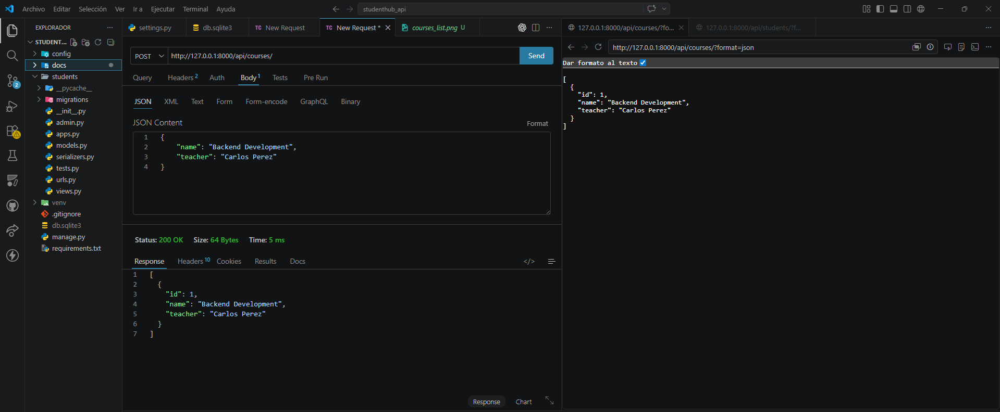
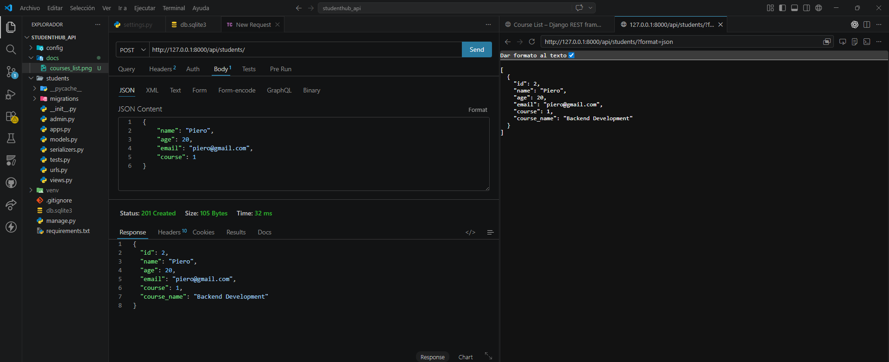
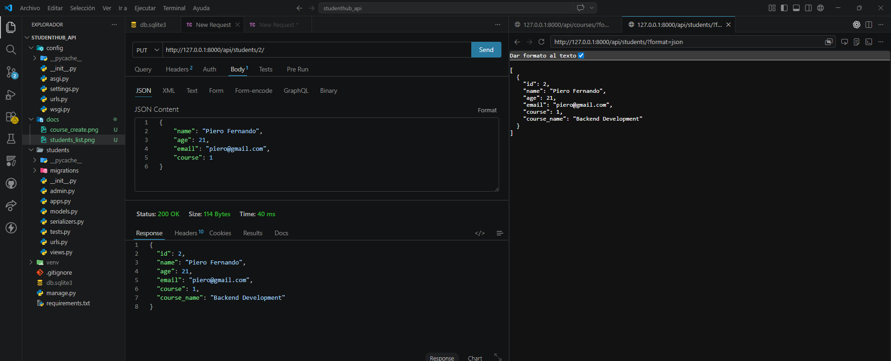
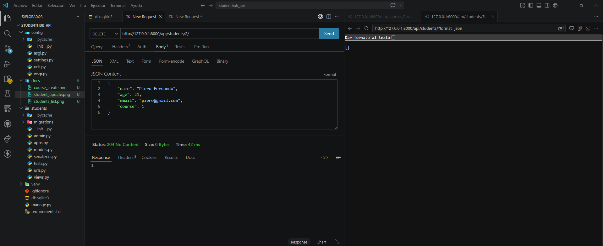

# StudentHub API
API REST desarrollada con Django y Django REST Framework para la gestión de estudiantes y cursos.

---
# Tecnologías utilizadas
- Python
- Django
- Django REST Framework
- SQLite
- Thunder
---
# Instalación y ejecución
## Clonar repositorio

```bash
git clone https://github.com/Piero-HO/StudentAPI.git
```
---
## Ingresar al proyecto
```bash
cd StudentAPI
```
---
## Crear entorno virtual
```bash
python -m venv venv
```
---
## Activar entorno virtual
```bash
venv\Scripts\activate
```
---
## Instalar dependencias
```bash
pip install -r requirements.txt
```
---
## Ejecutar migraciones
```bash
python manage.py migrate
```
---
## Ejecutar servidor
```bash
python manage.py runserver
```
---

# Endpoints disponibles

## Courses

| Método | Endpoint |
|---|---|
| GET | /api/courses/ |
| POST | /api/courses/ |
| PUT | /api/courses/id/ |
| DELETE | /api/courses/id/ |

---

## Students

| Método | Endpoint |
|---|---|
| GET | /api/students/ |
| POST | /api/students/ |
| PUT | /api/students/id/ |
| DELETE | /api/students/id/ |

---

# Búsqueda

```bash
/api/students/?search=piero
```

---

# Ejemplos de uso con cURL

## Obtener cursos

```bash
curl http://127.0.0.1:8000/api/courses/
```

---

## Crear curso

```bash
curl -X POST http://127.0.0.1:8000/api/courses/ \
-H "Content-Type: application/json" \
-d "{\"name\":\"Backend Development\",\"teacher\":\"Carlos Perez\"}"
```

---

## Obtener estudiantes

```bash
curl http://127.0.0.1:8000/api/students/
```

---

## Crear estudiante

```bash
curl -X POST http://127.0.0.1:8000/api/students/ \
-H "Content-Type: application/json" \
-d "{\"name\":\"Piero\",\"age\":20,\"email\":\"piero@gmail.com\",\"course\":1}"
```

---

## Buscar estudiante

```bash
curl http://127.0.0.1:8000/api/students/?search=piero
```

---

# Capturas

## Lista de cursos


---

## Crear curso



---

## Lista de estudiantes



---

## Buscar estudiante


---

## Actualizar estudiante



---

## Eliminar estudiante



---

# Autor

Piero Fernando Huaytalla Otarola